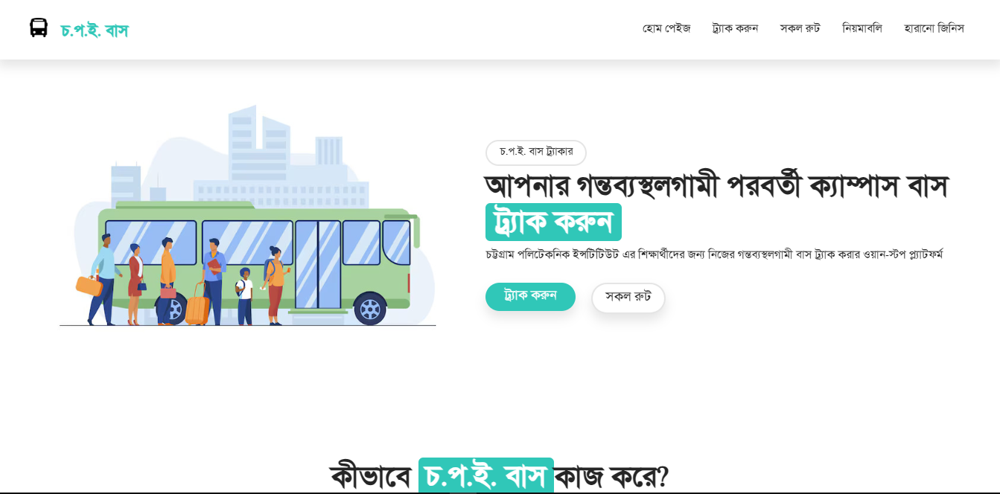
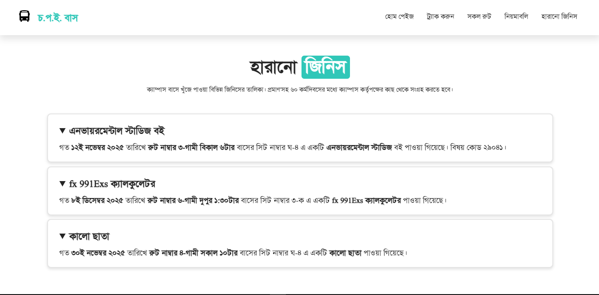
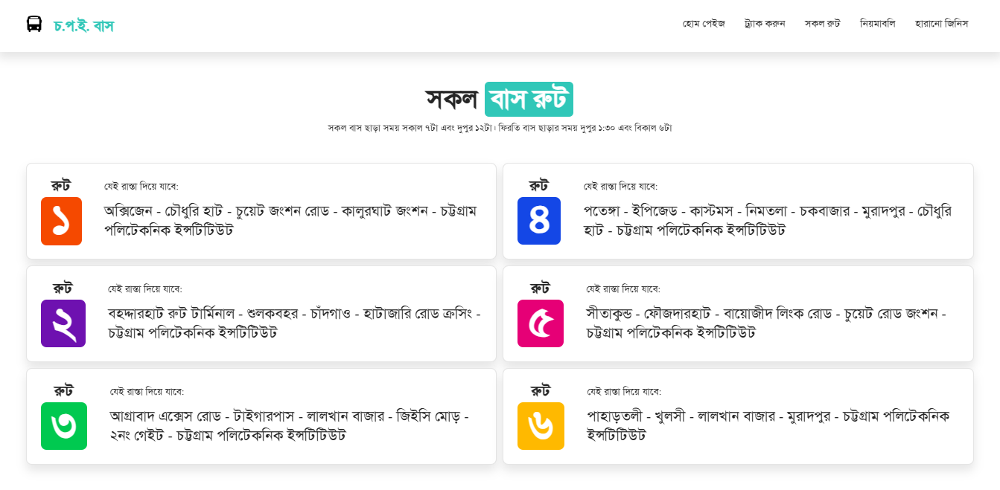

  
  # চট্টগ্রাম পলিটেকনিক ইন্সটিটিউট বাস
  
  
  
  

  ⭐ Star on GitHub if you like — it motivates me a lot!
  

 

So, on my Diploma-in-Engineer on Computer Science & Technolgy curriculam, there was a subject in 4th Semester called Web Design and Development. Under that subject, we as a team was needed to present a website of our own. As a Captain and Lead Developer of our team, me and my team decided to build this project called "Chattogram Polytechnic Institute Bus tracker" which is initially a bus tracker for our campus. Although when we were making this project, there was no bus service in our campus. So our whole project was made based on mockdata.

Projects Sneakpeak:  

## Technical details

Well, for this website, these tech stacks are used. The goal of this website was to make it responsive, informative and user-friendly. 

<b>All the information of this website is imaginary.</b>

## Features

- <b> Tracking </b>: Track your campus bus on realtime with the info number of seats and possible required time to arrive at user's stop
- <b> Lost & Found </b>: A dedicated page for the user to check for their lost items with enough detail to ensure that it theirs.
- <b> In-depth Details </b>: Dedicated page for all the routes and all the rules so user can instantly refer to them.
 
 

## Team Members of this project

- Tarunna Sen (Team Lead)
- Purnata Barua Pujaprema
- Md. Abrarul Anwar
- Sonia Akter
 

 

If you have any suggestions or anything to say related to this project, let me know.