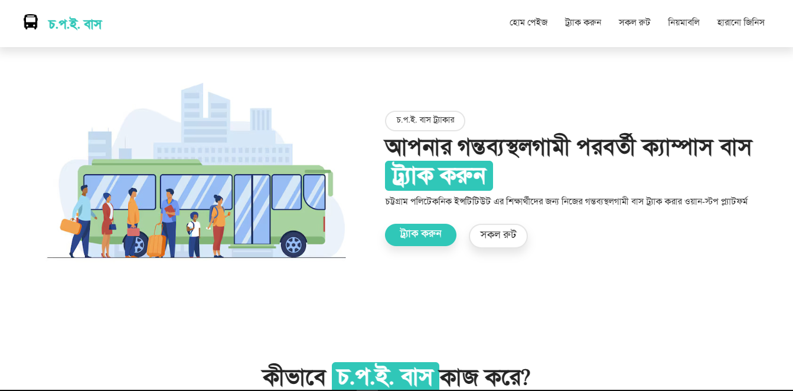
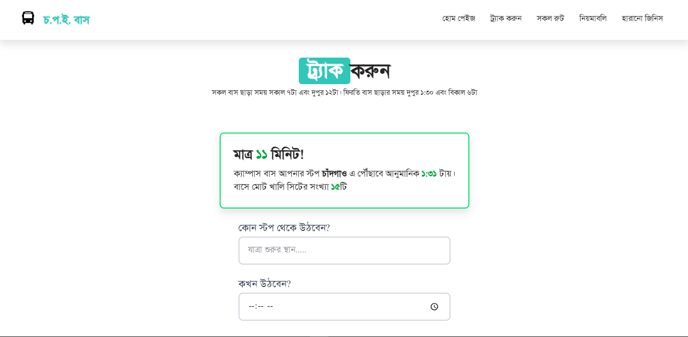
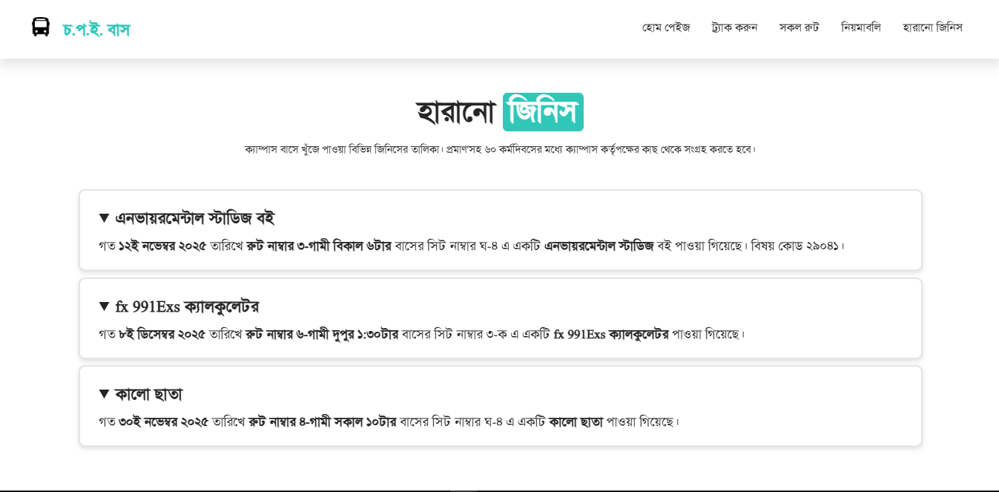
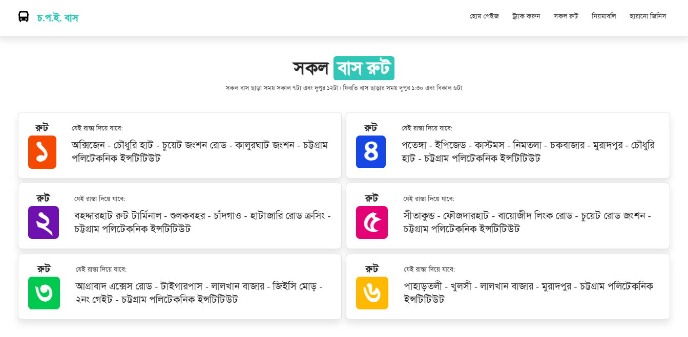
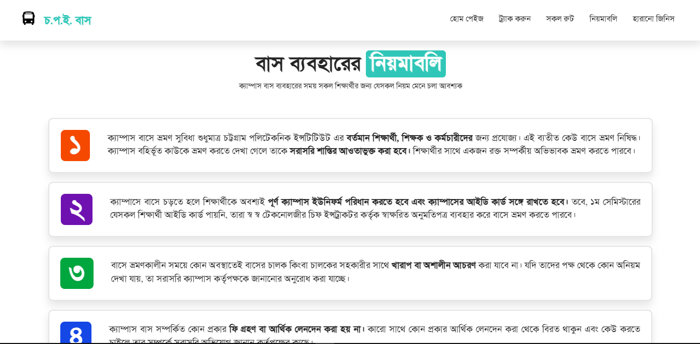
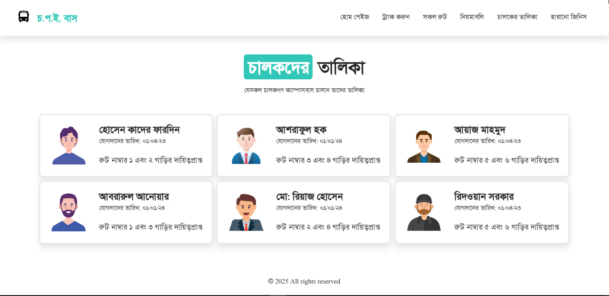

  
  # চট্টগ্রাম পলিটেকনিক ইন্সটিটিউট বাস
  
  
  
  

  ⭐ Star on GitHub if you like — it motivates me a lot!
  

 

So, on my Diploma-in-Engineer on Computer Science & Technolgy curriculam, there was a subject in 4th Semester called Web Design and Development. Under that subject, we as a team were needed to present a website of our own. As a Captain and Lead Developer of our team, my team and I decided to build this project called "Chattogram Polytechnic Institute Bus Tracker", which is initially a bus tracker for our campus. Although when we were making this project, there was no bus service on our campus. So our whole project was made based on mock data.

Projects Sneakpeak:  

## Technical details

Well, for this website, these tech stacks are used. The goal of this website was to make it responsive, informative, and user-friendly. 

<b>All the information on this website is imaginary.</b>

## Features

- <b> Tracking </b>: Track your campus bus in real-time with the info number of seats and the possible required time to arrive at the user's stop
- <b> Lost & Found </b>: A dedicated page for the user to check for their lost items with enough detail to ensure that it's theirs.
- <b> In-depth Details </b>: Dedicated page for all the routes and all the rules so the user can instantly refer to them.
- <b> Drivers Details </b>: Dedicated page for all the bus drivers info.
 
 

 

## Dependencies

<code>react</code> <code>react-router-dom</code> <code>scrollreveal</code> <code>tailwindcss</code>

 

## Run Locally

Clone the project 
<code>git clone https://github.com/T4RUNN4/Chattogram-Polytechnic-Institute-Bus.git</code>  
Install Dependencies 
<code>npm install</code>  
Run the project 
<code>npm run dev</code>  

## Live Link
Browse the project from here: <a href="https://cpi-bus.vercel.app">cpi-bus.vercel.app</a>

 

 

If you have any suggestions or anything to say related to this project, let me know.
